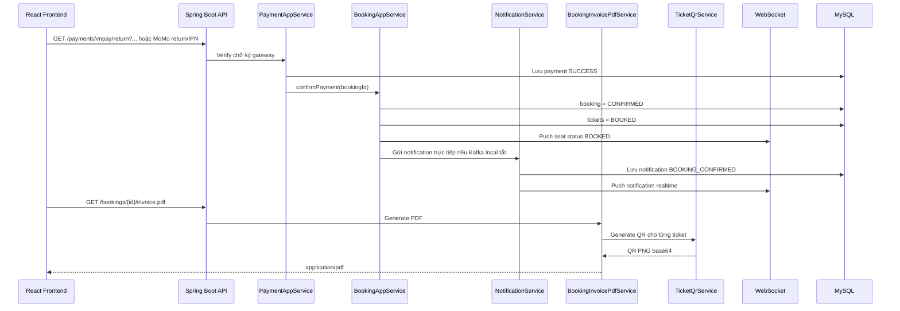
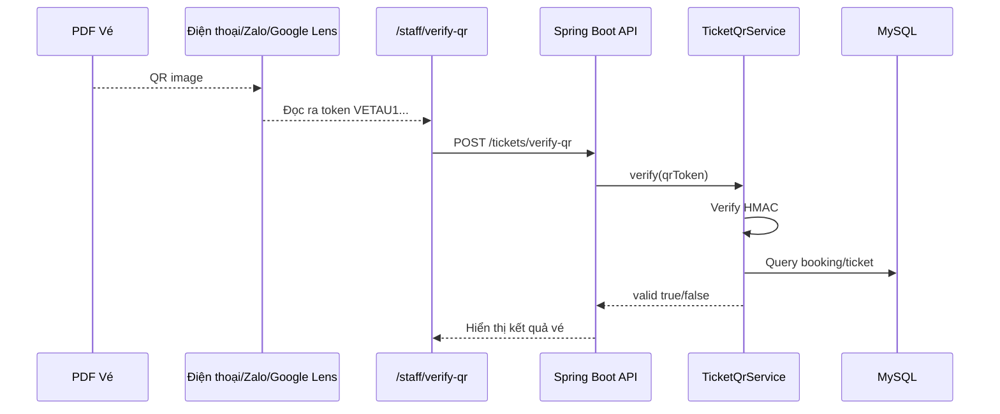

# Luồng thanh toán thành công, PDF vé và QR code

Tài liệu này mô tả flow sau khi user thanh toán thành công: backend cập nhật booking/payment, lưu notification, push realtime, generate PDF hóa đơn/vé có QR code, và staff/admin scan QR để xác minh vé.

PDF không được render bằng screenshot từ frontend. Backend sinh PDF từ dữ liệu thật trong database, frontend chỉ tải file về. QR trong PDF là ảnh chứa signed token do backend ký, không phải `ticketId` trần.

## Mục tiêu

- Sau thanh toán thành công, booking chuyển sang `CONFIRMED`.
- Payment được lưu/cập nhật `SUCCESS`.
- Ticket trong booking chuyển sang `BOOKED`.
- Notification `BOOKING_CONFIRMED` được lưu DB và push realtime.
- User tải được PDF hóa đơn/vé.
- Mỗi vé trong PDF có QR riêng.
- Staff/admin scan QR để xác minh vé trước khi cho lên tàu.

## Flow Tổng Quát



## Dữ Liệu Được Lưu Sau Thanh Toán

### Bảng `bookings`

Sau thanh toán thành công:

```text
status = CONFIRMED
```

Các field giá vẫn giữ theo booking:

```text
original_price
promo_code
discount_amount
total_price
```

### Bảng `payments`

Tạo hoặc cập nhật payment mới nhất:

```text
method = VNPAY hoặc MOMO
status = SUCCESS
amount = số tiền đã thanh toán
transaction_id = mã giao dịch từ cổng thanh toán
paid_at = thời điểm backend xác nhận
```

### Bảng `tickets`

Các vé thuộc booking:

```text
status = BOOKED
hold_expired_at = null
```

### Bảng `notifications`

Backend lưu notification:

```text
type = BOOKING_CONFIRMED
reference_id = bookingId
is_read = 0
```

Ví dụ:

```text
title = Dat ve thanh cong #4
content = Don hang #4 da duoc xac nhan thanh cong...
```

## Realtime Sau Thanh Toán

Backend push realtime qua WebSocket:

```text
/topic/trips/{tripId}/seats
```

Dùng để cập nhật trạng thái ghế `BOOKED`.

```text
/topic/users/{userId}/notifications
/user/{userId}/queue/notifications
```

Dùng để push notification cho user.

Local đang tắt Kafka thì backend vẫn lưu notification trực tiếp:

```yaml
vetautet:
  kafka:
    producer:
      enabled: ${KAFKA_PRODUCER_ENABLED:false}
```

Khi `KAFKA_PRODUCER_ENABLED=true`, backend publish event `payment-confirmed` để Kafka consumer xử lý notification/email.

## API Tải PDF

```http
GET /api/v1/bookings/{bookingId}/invoice.pdf
Authorization: Bearer <customerToken>
```

Response:

```http
HTTP/1.1 200 OK
Content-Type: application/pdf
Content-Disposition: attachment; filename="vetau-booking-{bookingId}.pdf"
```

Rule:

- User phải đăng nhập role `CUSTOMER`.
- User chỉ tải được booking của chính mình.
- Booking phải `CONFIRMED`.
- Nếu booking có payment record thì `paymentStatus` phải là `SUCCESS`.

Lỗi thường gặp:

```text
403
```

Không gửi token hoặc không có quyền.

```text
BOOKING_NOT_CONFIRMED
```

Booking chưa xác nhận.

```text
PAYMENT_NOT_SUCCESS
```

Payment chưa thành công.

## PDF Có Lưu Ở Đâu?

Hiện tại PDF được backend generate on demand khi user bấm tải:

```text
GET /bookings/{bookingId}/invoice.pdf
```

Backend trả `byte[] PDF`, browser sẽ lưu file về máy user, ví dụ:

```text
vetau-booking-4.pdf
```

Không lưu binary PDF vào MySQL. Đây là cách nên dùng cho giai đoạn hiện tại vì PDF luôn lấy dữ liệu mới nhất từ DB, nhẹ hơn và tránh lưu file thừa.

Nếu sau này muốn lưu file PDF cố định sau thanh toán, có thể thêm storage:

- Local filesystem.
- Cloudinary/S3/MinIO.
- Bảng `booking_documents` lưu `booking_id`, `file_url`, `created_at`.

## PDF Hiển Thị Gì?

PDF hiện có:

- Logo/thương hiệu `VÉ TÀU`.
- Mã booking.
- Trạng thái booking.
- Tuyến đi.
- Mã tàu.
- Giờ đi, giờ đến.
- Payment method và payment status.
- Hành khách.
- Toa, ghế, giá vé.
- QR code riêng cho từng vé.
- Tạm tính.
- Mã giảm giá.
- Số tiền giảm.
- Tổng thanh toán.

QR trong PDF:

- Hiển thị dạng ảnh ở cột `QR`.
- Dưới ảnh có mã ngắn như `#501`.
- `#501` chỉ là `ticketId`, không phải token.
- Token thật nằm bên trong ảnh QR.

## QR Token

Không dùng `ticketId` trần vì dễ đoán và dễ fake.

Token có format:

```text
VETAU1.<base64url("bookingId:ticketId")>.<hmacSha256Signature>
```

Ví dụ dev cho booking `4`, ticket `501`:

```text
VETAU1.NDo1MDE.1hbrQTLSm2z7MEx2lpiGjm9O_QqhlvJS_mPCD7Ad4Fs
```

Backend verify:

1. Kiểm tra prefix `VETAU1`.
2. Decode payload để lấy `bookingId` và `ticketId`.
3. Tính lại HMAC signature bằng secret backend.
4. So sánh signature.
5. Chỉ khi chữ ký hợp lệ mới query DB.
6. Kiểm tra booking `CONFIRMED`.
7. Kiểm tra ticket `BOOKED`.
8. Trả thông tin vé.

Config QR secret:

```yaml
ticket:
  qr:
    secret: ${TICKET_QR_SECRET:${jwt.secret}}
```

Production nên set `TICKET_QR_SECRET` riêng, không dùng chung JWT secret.

## API QR

### Lấy ảnh QR riêng

```http
GET /api/v1/tickets/{ticketId}/qr.png?bookingId={bookingId}
Authorization: Bearer <customerToken>
```

Response:

```http
Content-Type: image/png
```

Rule:

- User phải là chủ booking.
- Ticket phải thuộc booking.
- Booking phải `CONFIRMED`.

### Verify QR

```http
POST /api/v1/tickets/verify-qr
Authorization: Bearer <staffOrAdminToken>
Content-Type: application/json

{
  "qrToken": "VETAU1...."
}
```

Chỉ role `STAFF` hoặc `ADMIN` được gọi API này.

Response hợp lệ:

```json
{
  "valid": true,
  "code": "VALID_TICKET",
  "message": "VALID_TICKET",
  "bookingId": 4,
  "ticketId": 501,
  "ticketStatus": "BOOKED",
  "bookingStatus": "CONFIRMED",
  "passengerName": "TranTienPhuc",
  "passengerIdCard": "4565656757",
  "seatNumber": "A1",
  "carriageNumber": "Toa 1 - Ghe Mem",
  "carriageTypeName": "Ghe mem dieu hoa",
  "trainCode": "SE1",
  "departureStation": "Ga Sai Gon",
  "arrivalStation": "Ga Ha Noi"
}
```

Response không hợp lệ:

```json
{
  "valid": false,
  "code": "INVALID_QR_TOKEN",
  "message": "QR token khong hop le"
}
```

## Staff Scan Flow



Nếu browser không hỗ trợ camera:

- Dùng điện thoại/Zalo/Google Lens quét QR trong PDF.
- Copy chuỗi `VETAU1...`.
- Paste vào ô `QR TOKEN`.
- Bấm `Xác minh vé`.

Lưu ý: `localhost` trên điện thoại trỏ về chính điện thoại. Nếu muốn điện thoại scan xong tự mở trang verify, cần dùng IP LAN, ngrok hoặc deploy.

## Frontend Download PDF

Sau khi payment success:

```js
async function downloadBookingInvoicePdf(bookingId, accessToken) {
  const res = await fetch(
    `http://localhost:8080/api/v1/bookings/${bookingId}/invoice.pdf`,
    {
      headers: {
        Authorization: `Bearer ${accessToken}`,
      },
    }
  );

  if (!res.ok) {
    throw new Error(await res.text());
  }

  const blob = await res.blob();
  const url = URL.createObjectURL(blob);

  const a = document.createElement("a");
  a.href = url;
  a.download = `vetau-booking-${bookingId}.pdf`;
  a.click();

  URL.revokeObjectURL(url);
}
```

Gợi ý UI:

- Trang payment success có nút `Tải hóa đơn PDF`.
- Trang booking detail có nút `Tải vé PDF` nếu booking `CONFIRMED`.
- Nếu API lỗi `BOOKING_NOT_CONFIRMED`, hiển thị booking chưa thanh toán xong.
- Nếu API lỗi `PAYMENT_NOT_SUCCESS`, hiển thị thanh toán chưa thành công.

## Frontend Verify QR

Trang gợi ý:

```text
/staff/verify-qr
```

Có thể dùng thư viện:

```bash
npm install html5-qrcode
```

Gọi API:

```js
async function verifyTicketQr(qrToken, accessToken) {
  const res = await fetch("http://localhost:8080/api/v1/tickets/verify-qr", {
    method: "POST",
    headers: {
      "Content-Type": "application/json",
      Authorization: `Bearer ${accessToken}`,
    },
    body: JSON.stringify({ qrToken }),
  });

  if (!res.ok) {
    throw new Error(await res.text());
  }

  return res.json();
}
```

## Backend Files

Payment, booking, PDF:

- `vetautet-controller/src/main/java/com/vetautet/controller/resource/BookingController.java`
- `vetautet-application/src/main/java/com/vetautet/application/service/order/BookingAppService.java`
- `vetautet-application/src/main/java/com/vetautet/application/service/order/impl/BookingAppServiceImpl.java`
- `vetautet-application/src/main/java/com/vetautet/application/service/order/BookingInvoicePdfService.java`

QR:

- `vetautet-application/src/main/java/com/vetautet/application/service/ticket/TicketQrService.java`
- `vetautet-controller/src/main/java/com/vetautet/controller/resource/TicketQrController.java`
- `vetautet-application/src/main/java/com/vetautet/application/dto/TicketQrVerifyRequest.java`
- `vetautet-application/src/main/java/com/vetautet/application/dto/TicketQrVerifyResponse.java`

Notification:

- `vetautet-domain/src/main/java/com/vetautet/domain/gateway/BookingNotificationGateway.java`
- `vetautet-infrastructure/src/main/java/com/vetautet/infrastructure/notification/BookingNotificationGatewayImpl.java`
- `vetautet-infrastructure/src/main/java/com/vetautet/infrastructure/notification/NotificationService.java`

Config:

- `vetautet-start/src/main/resources/application.yml`
- `vetautet-application/pom.xml`

## Dependencies

PDF:

```xml
<dependency>
    <groupId>com.openhtmltopdf</groupId>
    <artifactId>openhtmltopdf-pdfbox</artifactId>
    <version>1.0.10</version>
</dependency>
```

QR:

```xml
<dependency>
    <groupId>com.google.zxing</groupId>
    <artifactId>core</artifactId>
    <version>3.5.3</version>
</dependency>

<dependency>
    <groupId>com.google.zxing</groupId>
    <artifactId>javase</artifactId>
    <version>3.5.3</version>
</dependency>
```

## Kiểm Thử Nhanh

Build:

```powershell
mvn -q -DskipTests install
```

Chạy backend local khi chưa bật Kafka:

```powershell
mvn -q org.springframework.boot:spring-boot-maven-plugin:3.4.4:run -Dspring-boot.run.arguments=--vetautet.kafka.listeners.enabled=false
```

Tải PDF:

```powershell
curl.exe -L `
  -H "Authorization: Bearer <customerToken>" `
  -o vetau-booking-4.pdf `
  "http://127.0.0.1:8080/api/v1/bookings/4/invoice.pdf"
```

Kết quả mong muốn:

- File có header `%PDF-`.
- PDF mở được.
- Trong PDF có QR ở cột `QR`.

Tải QR PNG:

```powershell
curl.exe -L `
  -H "Authorization: Bearer <customerToken>" `
  -o ticket-501-qr.png `
  "http://127.0.0.1:8080/api/v1/tickets/501/qr.png?bookingId=4"
```

Kết quả mong muốn:

- File có header PNG: `89 50 4E 47`.

Verify QR:

```powershell
curl.exe -X POST "http://127.0.0.1:8080/api/v1/tickets/verify-qr" `
  -H "Authorization: Bearer <staffOrAdminToken>" `
  -H "Content-Type: application/json" `
  -d "{\"qrToken\":\"VETAU1.NDo1MDE.1hbrQTLSm2z7MEx2lpiGjm9O_QqhlvJS_mPCD7Ad4Fs\"}"
```

Kết quả mong muốn:

```json
{
  "valid": true,
  "code": "VALID_TICKET"
}
```

Kiểm tra notification DB:

```sql
select id, user_id, title, type, reference_id, is_read, created_at
from notifications
where reference_id = 4
order by id desc;
```

Kiểm tra unread count:

```http
GET /api/v1/notifications/unread-count
Authorization: Bearer <customerToken>
```

Kết quả mong muốn:

```json
{
  "unreadCount": 1
}
```

## Ghi Chú Kỹ Thuật

- OpenHTMLToPDF parse HTML khá chặt theo XML, nên template không dùng `<!doctype html>`.
- CSS trong PDF nên giữ đơn giản: table, border, font, spacing.
- Font ưu tiên `Arial` trên Windows để render tiếng Việt đúng.
- Dữ liệu động từ DB phải escape HTML trước khi đưa vào template.
- QR dùng ZXing để sinh PNG.
- QR trong PDF được embed bằng `data:image/png;base64,...`.
- `TicketQrService.verify` luôn verify HMAC trước, sau đó mới query DB.
- API verify QR chỉ cho role `STAFF` hoặc `ADMIN`.
- API lấy QR riêng chỉ cho role `CUSTOMER` và phải đúng chủ booking.
- Notification direct fallback giúp local chạy ổn khi Kafka chưa bật.
