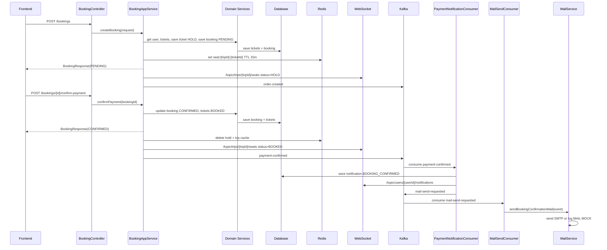
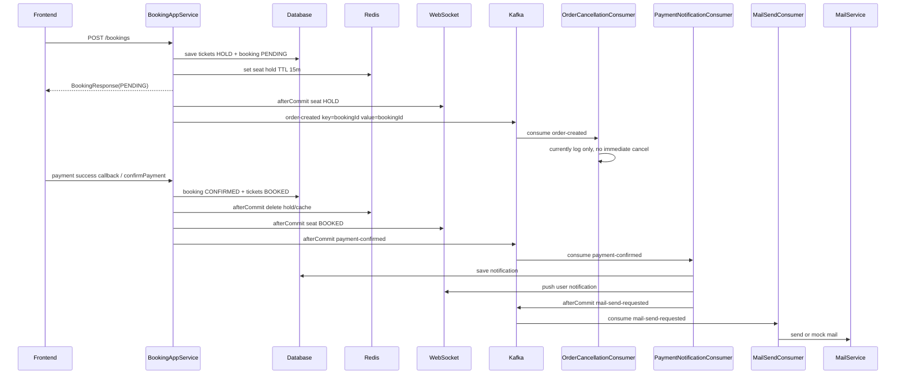

# Luồng xử lý đặt vé, thanh toán, realtime và gửi mail

Tài liệu này mô tả luồng hiện tại của hệ thống VeTau-v1 sau khi khách chọn ghế, tạo booking, xác nhận thanh toán, cập nhật realtime cho sơ đồ ghế, thông báo chuông cho user và gửi mail qua Kafka.

## 1. Tổng quan kiến trúc

Luồng nghiệp vụ đi theo hướng DDD:

```text
Controller -> Application Service -> Domain Service -> Repository Interface -> Infrastructure Repository -> Database
```

Các phần ngoài nghiệp vụ chính:

- Redis: giữ chỗ ghế tạm thời và cache trip.
- Redisson: lock chống đặt trùng ghế.
- WebSocket/STOMP: realtime trạng thái ghế và chuông thông báo.
- Kafka: xử lý notification và mail bất đồng bộ.
- MailService: gửi email thật nếu bật SMTP, fallback log mock nếu chưa cấu hình.

## 2. Luồng giữ chỗ

API:

```http
POST /api/v1/bookings
Authorization: Bearer <accessToken>
```

Request:

```json
{
  "tripId": 1,
  "ticketIds": [10, 11],
  "passengers": [
    {
      "ticketId": 10,
      "name": "Nguyen Van A",
      "idCard": "012345678901"
    }
  ]
}
```

Các bước xử lý:

1. `BookingController` gọi `BookingAppService.createBooking`.
2. `BookingAppServiceImpl` kiểm tra user hiện tại từ `SecurityContext`.
3. Hệ thống sort `ticketIds` rồi lấy Redisson `MultiLock` theo từng ticket.
4. Domain service lấy danh sách ticket từ DB.
5. Nếu ticket không tồn tại hoặc không ở trạng thái `AVAILABLE`, hệ thống trả lỗi.
6. Với mỗi ticket hợp lệ:
   - Set DB status: `HOLD`.
   - Set `holdExpiredAt = now + 15 minutes`.
   - Ghi Redis key: `seat:{tripId}:{ticketId}` với TTL 15 phút.
   - Lưu ticket vào DB.
7. Tạo `Booking` trạng thái `PENDING`.
8. Tạo `BookingDetail` cho từng ticket.
9. Lưu booking vào DB.
10. Xóa cache trip list/detail liên quan.
11. Sau khi transaction commit, bắn realtime ghế `HOLD`.
12. Gửi Kafka topic `order-created` để phục vụ xử lý timeout/cancel sau này.

Realtime ghế khi giữ chỗ:

Destination:

```text
/topic/trips/{tripId}/seats
```

Payload:

```json
{
  "tripId": 1,
  "ticketId": 10,
  "seatNumber": "A1",
  "status": "HOLD"
}
```

## 3. Luồng xác nhận thanh toán

API:

```http
POST /api/v1/bookings/{bookingId}/confirm-payment
Authorization: Bearer <accessToken>
```

Các bước xử lý:

1. `BookingController` gọi `BookingAppService.confirmPayment(bookingId)`.
2. `confirmPayment` gọi `updateBookingStatus(bookingId, "CONFIRMED")`.
3. Hệ thống lấy booking từ domain service.
4. Set booking status: `CONFIRMED`.
5. Với từng ticket trong booking:
   - Set ticket status: `BOOKED`.
   - Set `holdExpiredAt = null`.
   - Lưu ticket vào DB.
6. Lưu booking vào DB.
7. Sau khi transaction commit:
   - Xóa Redis hold key: `seat:{tripId}:{ticketId}`.
   - Xóa cache: `trip:{tripId}`.
   - Xóa cache: `trips:all`.
   - Bắn realtime ghế `BOOKED` cho tất cả người đang xem trip.
   - Bắn Kafka topic `payment-confirmed`.

Realtime ghế khi thanh toán thành công:

Destination:

```text
/topic/trips/{tripId}/seats
```

Payload:

```json
{
  "tripId": 1,
  "ticketId": 10,
  "seatNumber": "A1",
  "status": "BOOKED"
}
```

Lưu ý: destination này là broadcast theo trip. Mọi FE đang subscribe cùng trip sẽ nhận để tô đỏ/trạng thái đã đặt.

## 3.1. Tạo thanh toán MoMo test

API:

```http
POST /api/v1/payments/momo/bookings/{bookingId}
Authorization: Bearer <accessToken>
```

Điều kiện:

- Booking phải đang ở trạng thái `PENDING`.
- Số tiền booking phải >= `1000` VND theo yêu cầu MoMo.
- Backend phải cấu hình đủ MoMo sandbox env:
  - `MOMO_PARTNER_CODE`
  - `MOMO_ACCESS_KEY`
  - `MOMO_SECRET_KEY`
  - `MOMO_REDIRECT_URL`
  - `MOMO_IPN_URL`

Response mẫu:

```json
{
  "bookingId": 88,
  "momoOrderId": "BOOKING-88-1777390000000",
  "requestId": "REQ-88-1777390000000",
  "amount": 250000,
  "resultCode": 0,
  "message": "Successful.",
  "payUrl": "https://test-payment.momo.vn/v2/gateway/pay?t=...",
  "deeplink": "momo://app?action=payWithApp...",
  "qrCodeUrl": "000201010212...",
  "deeplinkMiniApp": "..."
}
```

FE xử lý:

- Web: redirect user sang `payUrl`.
- Mobile: có thể dùng `deeplink`.
- QR: dùng `qrCodeUrl` để render QR nếu cần.

## 3.2. MoMo IPN callback

MoMo gọi về backend sau khi user thanh toán:

```http
POST /api/v1/payments/momo/ipn
```

Endpoint này `permitAll` vì request đến từ MoMo server, không có JWT của user.

Các bước xử lý IPN:

1. Backend verify chữ ký MoMo theo HMAC_SHA256.
2. Parse `bookingId` từ `orderId`, format hiện tại: `BOOKING-{bookingId}-{timestamp}`.
3. Nếu `resultCode = 0`, hệ thống gọi `confirmPayment(bookingId)`.
4. `confirmPayment` cập nhật DB, bắn realtime ghế `BOOKED`, bắn Kafka `payment-confirmed`.
5. Nếu booking đã `CONFIRMED`, IPN được xử lý idempotent và không confirm lại.

IPN payload chính:

```json
{
  "partnerCode": "MOMO_PARTNER_TEST",
  "orderId": "BOOKING-88-1777390000000",
  "requestId": "REQ-88-1777390000000",
  "amount": 250000,
  "orderInfo": "Thanh toan don dat ve #88",
  "orderType": "momo_wallet",
  "transId": 4088878653,
  "resultCode": 0,
  "message": "Successful.",
  "payType": "qr",
  "responseTime": 1777390000000,
  "extraData": "eyJib29raW5nSWQiOjg4fQ==",
  "signature": "..."
}
```

Response IPN:

```json
{
  "resultCode": 0,
  "message": "Payment confirmed"
}
```

## 3.3. Cấu hình MoMo sandbox

`application.yml` đang đọc env:

```yaml
momo:
  endpoint: ${MOMO_ENDPOINT:https://test-payment.momo.vn/v2/gateway/api/create}
  partner-code: ${MOMO_PARTNER_CODE:}
  access-key: ${MOMO_ACCESS_KEY:}
  secret-key: ${MOMO_SECRET_KEY:}
  redirect-url: ${MOMO_REDIRECT_URL:http://localhost:5173/payment/momo-return}
  ipn-url: ${MOMO_IPN_URL:http://localhost:8080/api/v1/payments/momo/ipn}
  lang: ${MOMO_LANG:vi}
```

Khi test local, `MOMO_IPN_URL` phải là URL public để MoMo gọi được, ví dụ dùng ngrok:

```text
MOMO_IPN_URL=https://abc-xyz.ngrok-free.app/api/v1/payments/momo/ipn
```

MoMo docs chính thức cho one-time payment yêu cầu gọi `POST /v2/gateway/api/create` với `requestType=captureWallet` và signature HMAC_SHA256.

## 4. Luồng notification chuông cho chính user đặt vé

Sau khi `confirmPayment` bắn Kafka `payment-confirmed`, luồng notification chạy bất đồng bộ:

1. `PaymentNotificationConsumer` lắng nghe topic `payment-confirmed`.
2. Consumer lấy booking từ DB.
3. `NotificationService.sendBookingConfirmation(booking)` tạo notification:
   - `userId`: user đặt vé.
   - `type`: `BOOKING_CONFIRMED`.
   - `referenceId`: `bookingId`.
   - `title`: ví dụ `Dat ve thanh cong #88`.
   - `content`: nội dung chi tiết đơn hàng và vé.
   - `isRead`: `false`.
4. Lưu notification vào DB.
5. Sau khi transaction commit, bắn realtime notification cho user.
6. Consumer tạo `BookingMailEvent`.
7. Sau khi commit, publish Kafka topic `mail-send-requested`.

Destination realtime chuông nên dùng cho FE:

```text
/topic/users/{userId}/notifications
```

Payload:

```json
{
  "notificationId": 123,
  "userId": 5,
  "bookingId": 88,
  "title": "Dat ve thanh cong #88",
  "content": "Xin chao ...",
  "type": "BOOKING_CONFIRMED",
  "referenceId": 88,
  "read": false,
  "createdAt": "2026-04-28T13:50:00"
}
```

Destination cũ vẫn được bắn để tương thích:

```text
/user/queue/notifications
```

Tuy nhiên FE nên ưu tiên subscribe:

```text
/topic/users/{userId}/notifications
```

Lý do: WebSocket hiện tại chưa gắn `Principal` từ JWT khi STOMP connect, nên topic theo `userId` rõ ràng và ổn định hơn.

## 5. Luồng gửi mail qua Kafka

Topic mail:

```text
mail-send-requested
```

Payload:

```json
{
  "bookingId": 88,
  "userId": 5,
  "recipientEmail": "customer@example.com",
  "subject": "Dat ve thanh cong #88",
  "content": "Xin chao ..."
}
```

Các bước xử lý:

1. `PaymentNotificationConsumer` publish `BookingMailEvent` vào topic `mail-send-requested`.
2. `MailSendConsumer` lắng nghe topic `mail-send-requested`.
3. `MailSendConsumer` gọi `MailService.sendBookingConfirmationMail(event)`.
4. `MailService` kiểm tra:
   - Nếu `vetautet.mail.enabled=false`, hệ thống log `[MAIL MOCK]`.
   - Nếu `vetautet.mail.enabled=true` và có SMTP config, hệ thống gửi mail bằng `JavaMailSender`.

Cấu hình bật mail thật:

```yaml
vetautet:
  mail:
    enabled: true

spring:
  mail:
    host: smtp.gmail.com
    port: 587
    username: ${MAIL_USERNAME}
    password: ${MAIL_PASSWORD}
    properties:
      mail:
        smtp:
          auth: true
          starttls:
            enable: true
```

## 6. Sequence tổng thể



## 7. FE cần subscribe những gì

Khi mở màn hình chi tiết trip:

```text
/topic/trips/{tripId}/seats
```

Xử lý `status`:

- `AVAILABLE`: ghế trống.
- `HOLD`: ghế đang được giữ.
- `BOOKED`: ghế đã đặt, tô đỏ/disable.

Khi user đăng nhập để nhận chuông thông báo:

```text
/topic/users/{userId}/notifications
```

Khi nhận event `BOOKING_CONFIRMED`:

- Tăng unread count.
- Thêm item vào dropdown chuông.
- Hiển thị nội dung `Dat ve thanh cong #{bookingId}`.
- Khi click notification, điều hướng tới chi tiết booking theo `bookingId` hoặc `referenceId`.

## 8. Các file liên quan

- `vetautet-application/src/main/java/com/vetautet/application/service/order/impl/BookingAppServiceImpl.java`
- `vetautet-domain/src/main/java/com/vetautet/domain/model/SeatStatusEvent.java`
- `vetautet-domain/src/main/java/com/vetautet/domain/model/UserNotificationEvent.java`
- `vetautet-domain/src/main/java/com/vetautet/domain/model/BookingMailEvent.java`
- `vetautet-infrastructure/src/main/java/com/vetautet/infrastructure/messaging/PaymentNotificationConsumer.java`
- `vetautet-infrastructure/src/main/java/com/vetautet/infrastructure/messaging/MailSendConsumer.java`
- `vetautet-infrastructure/src/main/java/com/vetautet/infrastructure/notification/NotificationService.java`
- `vetautet-infrastructure/src/main/java/com/vetautet/infrastructure/notification/MailService.java`
- `vetautet-infrastructure/src/main/java/com/vetautet/infrastructure/config/KafkaConfig.java`
- `vetautet-infrastructure/src/main/java/com/vetautet/infrastructure/config/WebSocketConfig.java`

## 9. VNPAY sandbox payment flow

VNPAY duoc tich hop song song voi MoMo. Flow chinh:

1. FE tao booking truoc, booking dang `PENDING`.
2. FE goi:

```http
POST /api/v1/payments/vnpay/bookings/{bookingId}
Authorization: Bearer <customer-token>
```

3. BE tao `vnp_TxnRef` dang `{bookingId}{timestamp}` toan so, ky HMAC_SHA512, tra ve `paymentUrl`.
4. FE redirect browser sang `paymentUrl`.
5. VNPAY redirect ve FE route:

```http
GET http://localhost:5173/payment/vnpay-return?...vnp_ResponseCode=00&vnp_TransactionStatus=00...
```

6. FE doc query params tu URL va goi backend endpoint:

```http
GET /api/v1/payments/vnpay/return?...vnp_ResponseCode=00&vnp_TransactionStatus=00...
```

7. BE verify `vnp_SecureHash`, check amount bang tong tien booking.
8. Neu `vnp_ResponseCode=00` va `vnp_TransactionStatus=00`, BE goi `confirmPayment(bookingId)`.
9. Sau do luong hien co tiep tuc chay: DB `CONFIRMED`, ticket `BOOKED`, realtime seat event, Kafka `payment-confirmed`, user notification, mail event.

Config sandbox dang co san trong `application.yml`:

```yaml
vnpay:
  pay-url: https://sandbox.vnpayment.vn/paymentv2/vpcpay.html
  tmn-code: ${VNPAY_TMN_CODE:}
  hash-secret: ${VNPAY_HASH_SECRET:}
  return-url: http://localhost:5173/payment/vnpay-return
  order-type: other
  expire-minutes: 15
```

IPN URL server-to-server da them:

```text
GET /api/v1/payments/vnpay/ipn
```

Khi gui cho VNPAY test case SIT, URL IPN can la public HTTPS vi server VNPAY goi ve server merchant. Neu dang chay local thi dung ngrok/cloudflared, vi du:

```text
https://abc-xyz.ngrok-free.app/api/v1/payments/vnpay/ipn
```

IPN response theo format VNPAY:

```json
{
  "RspCode": "00",
  "Message": "Confirm Success"
}
```

Neu VNPAY tra ve `Error.html?code=71` / `Website nay chua duoc phe duyet`, do la merchant terminal `vnp_TmnCode` chua duoc VNPAY duyet hoac public sample key khong con dung duoc. Neu tra `Error.html?code=70` / `Sai chu ky`, can kiem tra lai `VNPAY_HASH_SECRET` va cach build checksum.

Test card sandbox hay dung:

```text
Ngan hang: NCB
So the: 9704198526191432198
Ten chu the: NGUYEN VAN A
Ngay phat hanh: 07/15
OTP: 123456
```

Callback VNPAY/MoMo hien duoc cau hinh ve FE page. Route FE can doc query params va goi lai backend endpoint `/api/v1/payments/vnpay/return` hoac `/api/v1/payments/momo/return` de BE verify chu ky va confirm booking.

## 10. Kafka flow khi booking

Section nay ghi lai dung flow Kafka hien tai trong code, de sau nay tach sang saga/outbox de hon.

### 10.1. Topics hien tai

```text
order-created
order-cancelled
payment-confirmed
mail-send-requested
```

Tat ca topic tren duoc khai bao trong `KafkaConfig`, moi topic dang tao voi:

```text
partitions: 3
replicas: 1
bootstrap-server: localhost:9092
```

`order-cancelled` da duoc khai bao topic nhung hien tai booking flow chua publish event nay.

### 10.2. Khi user tao booking / giu ghe

Producer:

```text
BookingAppServiceImpl.createBooking(...)
```

Sau khi:

1. Lay Redisson multi lock theo ticket.
2. Kiem tra ticket con `AVAILABLE`.
3. Set ticket status `HOLD`.
4. Set Redis key `seat:{tripId}:{ticketId}` TTL 15 phut.
5. Tao booking status `PENDING`.
6. Luu booking vao DB.
7. Xoa cache `trip:{tripId}` va `trips:all`.

Backend publish Kafka:

```java
kafkaTemplate.send("order-created", savedBooking.getId().toString(), savedBooking.getId());
```

Message:

```json
{
  "topic": "order-created",
  "key": "{bookingId}",
  "value": 43
}
```

Log producer:

```text
>>> [BOOKING LOCKED] Thanh cong giu cho cho booking: {bookingId}
```

Consumer:

```text
OrderCancellationConsumer.handleOrderTimeout(Long bookingId)
@KafkaListener(topics = "order-created", groupId = "vetautet-group")
```

Hien tai consumer chi log event, khong huy booking ngay:

```text
>>> Kafka received Order Created event for ID: {bookingId}. (Immediate cancellation disabled for testing)
```

Ly do: logic huy booking ngay khi vua tao la sai nghiep vu. De dung hon can delay queue, scheduled task, Redis expiration event, hoac saga timeout. Khi nang len saga parent, `order-created` nen tro thanh event khoi tao timeout 15 phut.

Luu y ky thuat hien tai:

- Realtime `HOLD` dang duoc ban bang WebSocket trong `afterCommit`.
- Kafka `order-created` dang duoc publish truc tiep trong transaction, chua boc `afterCommit`.
- Neu transaction rollback sau khi Kafka da send, event co the bi lech voi DB.
- Nen doi sang `afterCommit` hoac transactional outbox khi lam nghiem tuc.

### 10.3. Khi thanh toan thanh cong

Payment co the thanh cong tu:

```text
POST /api/v1/bookings/{bookingId}/confirm-payment
GET  /api/v1/payments/vnpay/return
GET  /api/v1/payments/vnpay/ipn
POST /api/v1/payments/momo/ipn
GET  /api/v1/payments/momo/return
```

Tat ca cac duong thanh toan hop le deu quy ve:

```text
BookingAppServiceImpl.confirmPayment(bookingId)
```

Sau khi:

1. Set booking status `CONFIRMED`.
2. Set ticket status `BOOKED`.
3. Clear `holdExpiredAt`.
4. Save DB.
5. Sau commit, delete Redis hold key va cache trip.
6. Sau commit, ban WebSocket seat status `BOOKED`.

Backend publish Kafka trong `afterCommit`:

```java
kafkaTemplate.send("payment-confirmed", bookingId.toString(), bookingId);
```

Message:

```json
{
  "topic": "payment-confirmed",
  "key": "{bookingId}",
  "value": 43
}
```

Log producer:

```text
>>> [NOTI] Da gui yeu cau gui ve ve email cho khach hang qua Kafka
```

Diem tot cua flow nay: `payment-confirmed` chi ban sau khi transaction confirm payment commit thanh cong.

### 10.4. Consumer tao notification cho user

Consumer:

```text
PaymentNotificationConsumer.handlePaymentConfirmed(Long bookingId)
@KafkaListener(topics = "payment-confirmed", groupId = "vetautet-group")
```

Xu ly:

1. Lay booking tu DB.
2. Goi `NotificationService.sendBookingConfirmation(booking)`.
3. Luu notification DB voi type `BOOKING_CONFIRMED`.
4. Push realtime notification cho user dat ve:

```text
/topic/users/{userId}/notifications
```

5. Tao `BookingMailEvent`.
6. Sau commit, publish Kafka topic `mail-send-requested`.

Log consumer:

```text
>>> [KAFKA] Nhan event payment-confirmed cho Booking: {bookingId}
>>> [NOTI] Da luu notification va push realtime cho Booking: {bookingId}
```

### 10.5. Event gui mail

Producer:

```text
PaymentNotificationConsumer
```

Publish sau commit:

```java
kafkaTemplate.send("mail-send-requested", bookingId.toString(), mailEvent);
```

Message:

```json
{
  "topic": "mail-send-requested",
  "key": "{bookingId}",
  "value": {
    "bookingId": 43,
    "userId": 7,
    "recipientEmail": "user@example.com",
    "subject": "Dat ve thanh cong #43",
    "content": "..."
  }
}
```

Consumer:

```text
MailSendConsumer.handleMailSendRequested(BookingMailEvent event)
@KafkaListener(topics = "mail-send-requested", groupId = "vetautet-mail-group")
```

Xu ly:

1. Log event.
2. Goi `MailService.sendBookingConfirmationMail(event)`.
3. Neu `vetautet.mail.enabled=false`, mail service log mock.
4. Neu bat SMTP va cau hinh `spring.mail.*`, he thong gui mail that.

Log:

```text
>>> [KAFKA] Published mail-send-requested for Booking: {bookingId}
>>> [KAFKA] Received mail-send-requested for bookingId={bookingId}
```

### 10.6. Thu tu event tong quat



### 10.7. Huong nang cap saga/outbox

Khi nang len saga parent, nen tach ro command/event:

```text
BookingCreated/PendingCreated
SeatHeld
PaymentRequested
PaymentSucceeded
PaymentFailed
BookingConfirmed
BookingExpired
NotificationRequested
MailRequested
```

Khuyen nghi:

1. Dung transactional outbox cho cac event quan trong.
2. Publish Kafka sau DB commit, khong publish giua transaction.
3. Gan `eventId`, `bookingId`, `userId`, `occurredAt`, `traceId`.
4. Consumer phai idempotent theo `eventId` hoac business key.
5. Timeout 15 phut nen do delay queue/scheduler/saga timeout xu ly, khong consume `order-created` roi cancel ngay.
