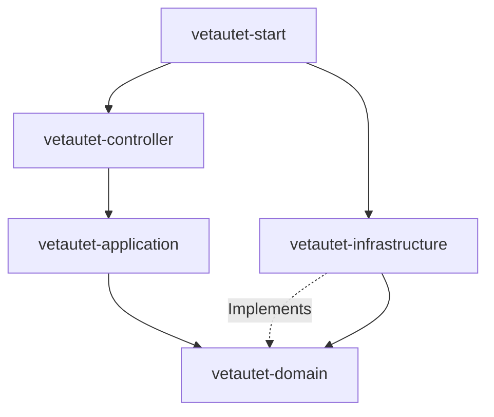
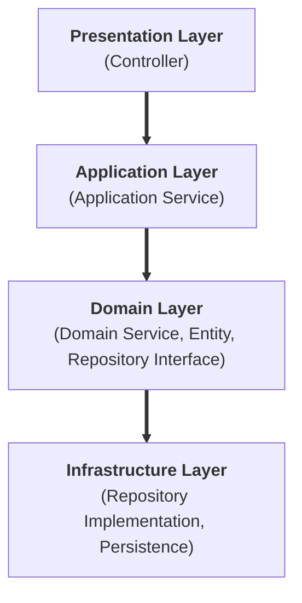
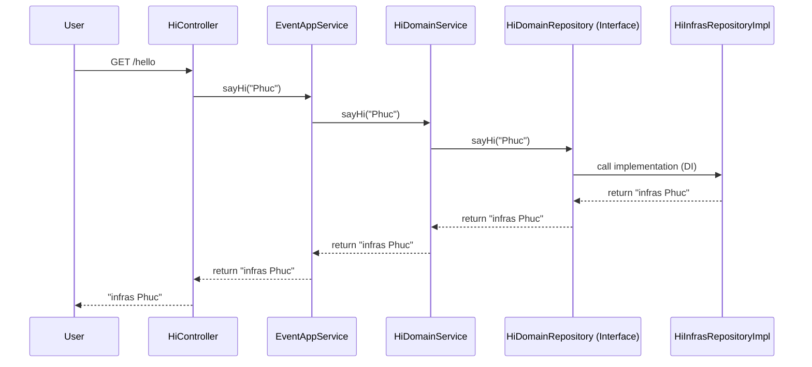
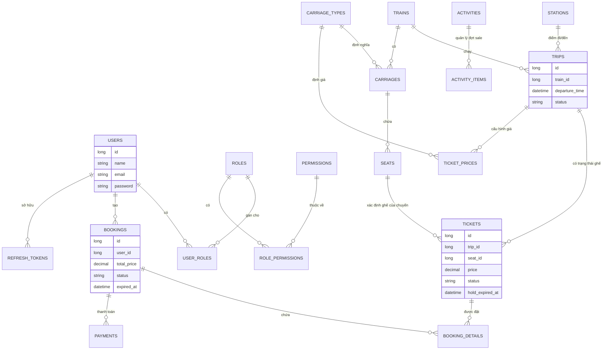

# Luồng chạy dự án (DDD Architecture)

## Sơ đồ kiến trúc Module
Dưới đây là cách các module phụ thuộc lẫn nhau theo kiến trúc DDD:

---

Dự án này tuân thủ kiến trúc **Domain-Driven Design (DDD)** với các module được phân tách rõ ràng. Dưới đây là luồng chạy chi tiết từ lúc nhận yêu cầu đến lúc trả về kết quả.

## Sơ đồ kiến trúc tầng (Dọc)

---

## Luồng chạy tóm tắt (Mũi tên)
**Request Flow:**
`Controller` ➡️ `Application Service` ➡️ `Domain Service` ➡️ `Repository Interface` ➡️ `Infrastructure Implementation`

**Response Flow:**
`Database` ⬅️ `Infrastructure` ⬅️ `Domain` ⬅️ `Application` ⬅️ `Controller` ⬅️ `User`

---

## 1. Các Module chính
- **`vetautet-start`**: Điểm khởi đầu của ứng dụng (Spring Boot Application).
- **`vetautet-controller`**: Lớp Interface, tiếp nhận các yêu cầu từ người dùng (REST API).
- **`vetautet-application`**: Lớp logic ứng dụng, điều phối các domain service để hoàn thành nghiệp vụ.
- **`vetautet-domain`**: Trái tim của hệ thống, chứa các quy tắc nghiệp vụ cốt lõi và định nghĩa interface cho repository.
- **`vetautet-infrastructure`**: Cung cấp các hiện thực hóa (implementation) cho repository (ví dụ: Database, External API).

## 2. Luồng chạy chi tiết (Example: `/hello`)

Khi người dùng gọi API `GET /hello`, luồng sẽ chạy qua các bước sau:

### Bước 1: Tiếp nhận yêu cầu (Controller Layer)
- **File**: `com.vetautet.controller.resource.HiController`
- **Hành động**: Tiếp nhận yêu cầu GET tại endpoint `/hello`. Nó gọi phương thức `sayHi` của `EventAppService`.

### Bước 2: Điều phối nghiệp vụ (Application Layer)
- **File**: `com.vetautet.application.service.event.impl.EventAppServiceImpl`
- **Hành động**: Nhận dữ liệu từ Controller, sau đó gọi xuống lớp Domain thông qua `HiDomainService`.

### Bước 3: Logic nghiệp vụ cốt lõi (Domain Layer)
- **File**: `com.vetautet.domain.service.impl.HiDomainServiceImpl`
- **Hành động**: Thực hiện các logic nghiệp vụ (nếu có). Trong trường hợp này, nó gọi đến Interface `HiDomainRepository` để lấy dữ liệu.
  - *Lưu ý*: Lớp Domain chỉ gọi qua Interface, không quan tâm dữ liệu lưu ở đâu.

### Bước 4: Truy xuất dữ liệu (Infrastructure Layer)
- **File**: `com.vetautet.infrastructure.persistence.repository.HiInfrasRepositoryImpl`
- **Hành động**: Hiện thực hóa interface `HiDomainRepository`. Đây là nơi thực hiện các câu lệnh SQL hoặc gọi API bên ngoài. Hiện tại nó trả về chuỗi `"infras " + name`.

### Bước 5: Trả về kết quả
- Dữ liệu đi ngược lại: `Infrastructure` -> `Domain` -> `Application` -> `Controller` -> `User`.

---

## Sơ đồ luồng dữ liệu (Data Flow)

```mermaid
flowchart LR
    subgraph External
        User((Người dùng))
    end

    subgraph Interface_Layer [vetautet-controller]
        Controller[REST Controller]
    end

    subgraph App_Layer [vetautet-application]
        AppService[Application Service]
    end

    subgraph Domain_Layer [vetautet-domain]
        DomainService[Domain Service]
        RepoInterface[[Repository Interface]]
    end

    subgraph Infra_Layer [vetautet-infrastructure]
        RepoImpl[Persistence Implementation]
        DB[(Database)]
    end

    User -->|API Request| Controller
    Controller --> AppService
    AppService --> DomainService
    DomainService --> RepoInterface
    RepoInterface -.->|Dependency Inversion| RepoImpl
    RepoImpl --> DB
    
    DB --> RepoImpl
    RepoImpl -.-> RepoInterface
    RepoInterface --> DomainService
    DomainService --> AppService
    AppService --> Controller
    Controller -->|API Response| User
```

---

## Sơ đồ Sequence (Luồng thực thi)

---

## Sơ đồ cơ sở dữ liệu (ERD)

