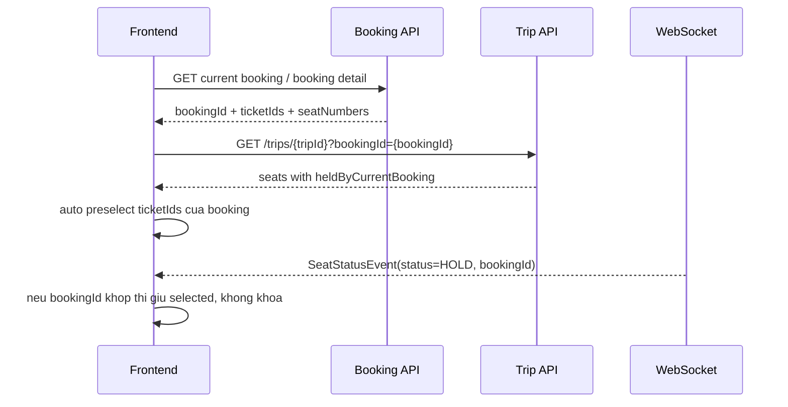

# Seat Hold Ownership Flow

## 1. Van de

Flow cu chi nhin status ghe:

```text
AVAILABLE => FE cho chon
HOLD      => FE khoa
BOOKED    => FE khoa
```

Neu user quay lai buoc chon ghe, cac ghe dang `HOLD` boi chinh booking cua user cung bi khoa nhu ghe cua nguoi khac. UX dung phai tach 2 loai:

```text
HOLD by current booking => van cho selected / bo selected / tiep tuc checkout
HOLD by other booking   => khoa that
```

## 2. BookingResponse tra them ticketIds

Sau khi tao booking hoac load booking, response co them `ticketIds`:

```json
{
  "bookingId": 43,
  "status": "PENDING",
  "seatNumbers": ["A1"],
  "ticketIds": [10]
}
```

FE dung `ticketIds` de:

1. Auto preselect ghe khi user quay lai step chon ghe.
2. Reconcile socket event realtime.
3. Khong disable ghe dang `HOLD` boi chinh booking hien tai.

## 3. Trip detail nhan bookingId tuy chon

Khi da co booking hien tai, FE goi:

```http
GET /api/v1/trips/{tripId}?bookingId={bookingId}
Authorization: Bearer {token}
```

Backend khong cache response user-specific nay vao Redis `trip:{tripId}`. Response ticket trong trip detail co them:

```json
{
  "id": 10,
  "seatNumber": "A1",
  "status": "HOLD",
  "heldByCurrentBooking": true,
  "holdingBookingId": 43
}
```

Neu ghe `HOLD` cua booking khac:

```json
{
  "id": 11,
  "seatNumber": "A2",
  "status": "HOLD",
  "heldByCurrentBooking": false,
  "holdingBookingId": null
}
```

Backend chi set `heldByCurrentBooking=true` khi:

1. `bookingId` ton tai.
2. Booking dang `PENDING`.
3. Booking thuoc user dang dang nhap.
4. Ticket dang nam trong booking detail va status hien tai la `HOLD`.

## 4. Realtime seat event co them bookingId

Socket topic van la:

```text
/topic/trips/{tripId}/seats
```

Payload moi:

```json
{
  "tripId": 1,
  "ticketId": 10,
  "seatNumber": "A1",
  "status": "HOLD",
  "bookingId": 43
}
```

FE xu ly:

```text
if event.status == HOLD and event.bookingId == currentBookingId:
    mark as held/selected by me, do not disable
else if event.status == HOLD:
    disable as held by others
else if event.status == BOOKED:
    disable as sold
else if event.status == AVAILABLE:
    enable unless currently selected locally
```

Neu FE nhan socket event cu hoac event khong co `bookingId`, fallback bang:

```text
currentBooking.ticketIds.contains(event.ticketId)
```

## 5. Luong user quay lai step chon ghe



## 6. File code lien quan

```text
vetautet-application/src/main/java/com/vetautet/application/dto/BookingResponse.java
vetautet-application/src/main/java/com/vetautet/application/dto/TicketResponse.java
vetautet-controller/src/main/java/com/vetautet/controller/resource/TripController.java
vetautet-application/src/main/java/com/vetautet/application/service/trip/impl/TripAppServiceImpl.java
vetautet-domain/src/main/java/com/vetautet/domain/model/SeatStatusEvent.java
vetautet-application/src/main/java/com/vetautet/application/service/order/impl/BookingAppServiceImpl.java
```
