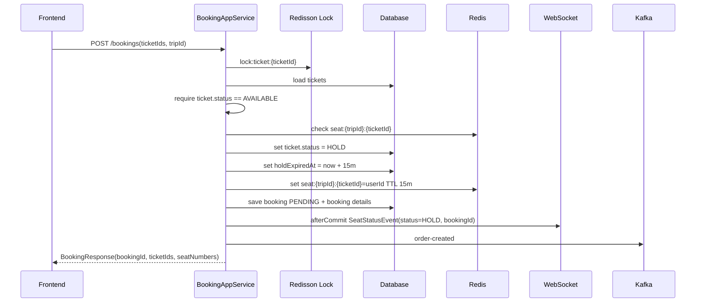

# Seat Hold Redis Flow

## 1. Muc tieu

Khi user chon ghe va tao booking, backend can giu ghe tam thoi de tranh user khac dat trung. He thong hien tai dung 2 lop trang thai:

```text
DB tickets.status     = source of truth dai han
Redis seat hold key   = lock tam thoi co TTL
```

Redis chi dung de giu cho nhanh trong thoi gian booking dang `PENDING`.

## 2. Key Redis dang dung

Format key:

```text
seat:{tripId}:{ticketId}
```

Vi du:

```text
seat:1:38
```

Value hien tai:

```text
userId
```

TTL:

```text
15 minutes
```

Code:

```text
BookingAppServiceImpl.SEAT_HOLD_KEY_PREFIX = "seat:"
BookingAppServiceImpl.SEAT_HOLD_TTL_MINUTES = 15
```

## 3. Trang thai lien quan

Ticket DB:

```text
AVAILABLE => ghe trong, co the dat
HOLD      => dang giu cho booking PENDING
BOOKED    => da thanh toan / da ban
```

Booking DB:

```text
PENDING   => da giu ghe, cho thanh toan
CONFIRMED => thanh toan thanh cong
CANCELLED / EXPIRED => huy hoac qua han
```

Redis:

```text
key exists     => dang co hold tam thoi
key not exists => khong co hold tam thoi
```

## 4. Luong tao booking / hold ghe

API:

```http
POST /api/v1/bookings
Authorization: Bearer {token}
```

Flow:



Response booking co:

```json
{
  "bookingId": 43,
  "status": "PENDING",
  "seatNumbers": ["A38"],
  "ticketIds": [38]
}
```

## 5. Luong xac nhan thanh toan

Khi payment success:

```text
BookingAppServiceImpl.confirmPayment()
BookingAppServiceImpl.updateBookingStatus(bookingId, "CONFIRMED")
```

Backend update:

```text
booking.status = CONFIRMED
ticket.status = BOOKED
ticket.holdExpiredAt = null
delete Redis key seat:{tripId}:{ticketId}
delete cache trip:{tripId}
delete cache trips:all
broadcast WebSocket status=BOOKED
publish Kafka payment-confirmed
```

Socket payload:

```json
{
  "tripId": 1,
  "ticketId": 38,
  "seatNumber": "A38",
  "status": "BOOKED",
  "bookingId": 43
}
```

## 6. Luong huy / het han

Khi booking bi cancel hoac expired:

```text
booking.status = CANCELLED / EXPIRED
ticket.status = AVAILABLE
ticket.holdExpiredAt = null
delete Redis key seat:{tripId}:{ticketId}
delete cache trip:{tripId}
delete cache trips:all
broadcast WebSocket status=AVAILABLE
```

Scheduler hien tai:

```text
TicketScheduler.releaseExpiredTickets()
@Scheduled(fixedRate = 60000)
```

Moi 60 giay scheduler quet:

```text
ticket.status = HOLD
ticket.holdExpiredAt < now
```

Sau do release ve `AVAILABLE` va xoa Redis hold key.

## 7. Loi stale Redis hold vua gap

Tinh huong:

Trip detail response tra:

```json
{
  "id": 38,
  "seatNumber": "A38",
  "status": "AVAILABLE"
}
```

Nhung khi tao booking lai loi:

```json
{
  "status": 400,
  "message": "Ghe A38 dang duoc nguoi khac giu cho. Vui long chon ghe khac!"
}
```

Nguyen nhan:

```text
DB:    tickets.status = AVAILABLE
Redis: seat:{tripId}:38 van con ton tai
```

Tuc la DB da release ghe, nhung Redis key hold chua duoc xoa hoac con song do cache/TTL bi lech. Backend cu chi can thay Redis key la chan, nen user thay ghe trong nhung khong dat duoc.

## 8. Cach update da sua

Trong `createBooking`, sau khi DB da confirm ticket dang `AVAILABLE`, backend check Redis key. Neu Redis key van con, backend coi do la stale hold va xoa:

```text
if ticket.status == AVAILABLE and Redis key exists:
    delete Redis key
    continue booking
```

Log:

```text
>>> [STALE HOLD] Removed Redis hold key seat:{tripId}:{ticketId}
    because ticket {ticketId} is AVAILABLE in DB. ttlSeconds={ttl}
```

Code lien quan:

```text
vetautet-application/src/main/java/com/vetautet/application/service/order/impl/BookingAppServiceImpl.java
```

Method:

```text
clearStaleSeatHold(redisKey, ticket)
```

## 9. Nguyen tac hien tai

Khi DB va Redis lech nhau:

```text
DB BOOKED/HOLD      => khong cho dat
DB AVAILABLE + no Redis key => cho dat
DB AVAILABLE + Redis key    => xoa Redis key stale roi cho dat
```

Ly do: DB la source of truth cho status ghe hien tai. Redis hold chi la lock tam thoi, khong nen override DB khi DB da `AVAILABLE`.

## 10. Huong nang cap sau

Nen nang cap theo cac diem sau:

1. Redis hold value nen luu object thay vi chi userId:

```json
{
  "bookingId": 43,
  "userId": 7,
  "ticketId": 38,
  "tripId": 1,
  "expiresAt": "2026-04-30T00:51:42"
}
```

2. Publish booking/seat event sau DB commit bang outbox.
3. Dung delayed queue hoac saga timeout de expire booking, khong rely hoan toan vao scheduler quet DB.
4. Khi release hold can idempotent:

```text
release chi duoc thuc hien neu booking van PENDING
khong release ticket da BOOKED
```

5. Trip detail nen co ownership:

```json
{
  "status": "HOLD",
  "heldByCurrentBooking": true,
  "holdingBookingId": 43
}
```

Phan ownership da tach trong:

```text
seat_hold_ownership_flow.md
```
